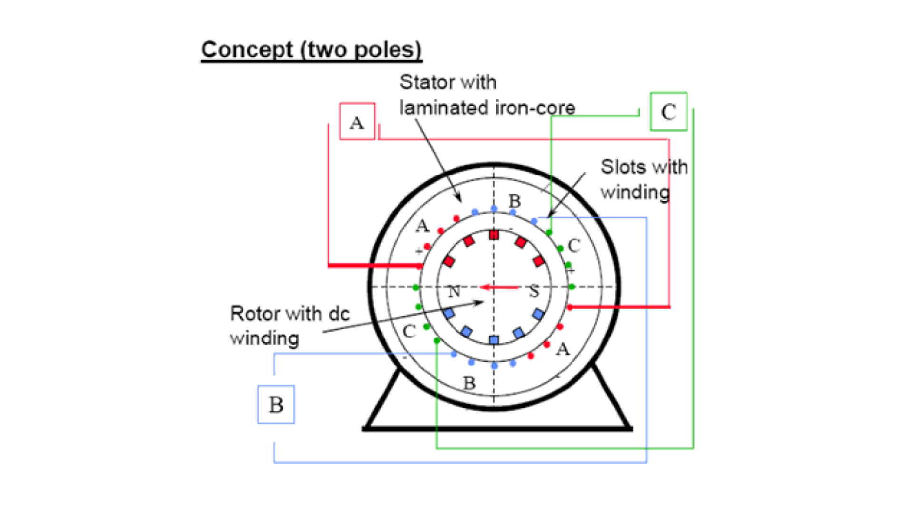

* Synchronous machines are principally used as alternating current (AC) generators. They supply the electric power used by all sectors of modern societies: industrial, commercial, agricultural, and domestic. 
* Synchronous generators usually operate together (or in parallel), forming a large power system supplying electrical energy to the loads or consumers. 
* Synchronous generators are built in large units, their rating ranging from tens to hundreds of megawatts. 
* Synchronous generator converts mechanical power to ac electric power. The source of mechanical power, the prime mover, may be a diesel engine, a steam turbine, a water turbine, or any similar device. 
* For high-speed machines, the prime movers are usually steam turbines employing fossil or nuclear energy resources. 
* Low-speed machines are often driven by hydro-turbines that employ water power for generation. 
* Smaller synchronous machines are sometimes used for private generation and as standby units, with diesel engines or gas turbines as prime movers. 

