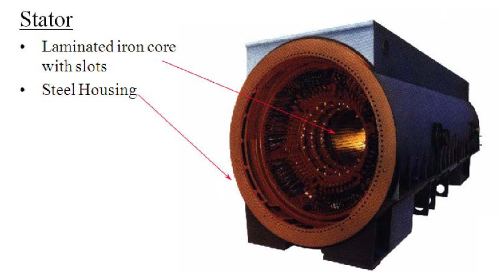
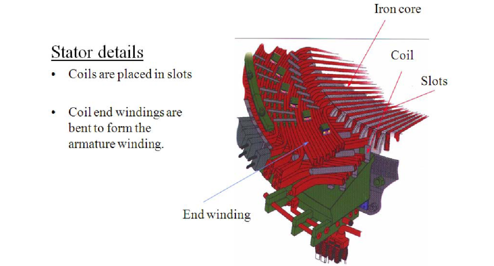

## General

* Synchronous machines are principally used as alternating current (AC) generators. They supply the electric power used by all sectors of modern societies: industrial, commercial, agricultural, and domestic. 
* Synchronous generators usually operate together (or in parallel), forming a large power system supplying electrical energy to the loads or consumers. 
* Synchronous generators are built in large units, their rating ranging from tens to hundreds of megawatts. 
* Synchronous generator converts mechanical power to ac electric power. The source of mechanical power, the prime mover, may be a diesel engine, a steam turbine, a water turbine, or any similar device. 
* For high-speed machines, the prime movers are usually steam turbines employing fossil or nuclear energy resources. 
* Low-speed machines are often driven by hydro-turbines that employ water power for generation. 
* Smaller synchronous machines are sometimes used for private generation and as standby units, with diesel engines or gas turbines as prime movers. 

## Types of Synchronous Machines
According to the arrangement of the field and armature windings
Rotating-Armature Type 
The armature winding is on the rotor and the field system is on the stator. 
2.  Rotating-Field Type
The armature winding is on the stator and the field system is on the rotor. 

According to the shape of the field

Cylindrical-rotor (non-salient pole) machines
The stator is a ring shaped laminated iron-core with slots.
Three phase windings are placed in the slots.
Round solid iron rotor with slots.
A single winding is placed in the slots. DC current is supplied through slip rings. 

Salient Pole rotor machine
The stator has a laminated iron-core with slots and three phase windings placed in the slots. 
The rotor has salient poles excited by DC current. 
DC current is supplied to the rotor through slip-rings and brushes. 
The number of poles varies between 2 – 128.

## Design Construction
The winding consists of copper bars insulted with mica and epoxy resin. 
The conductors are secured by steel wedges. 
The iron core is supported by a steel housing.

### Non Salient Pole (round rotor)
* The round rotor is used high speed (3600 rpm) machines.
* A forged iron core (not laminated, DC) is installed on the shaft. 
* Slots are milled in the iron and insulated copper bars are placed in the slots.
* The slots are closed by wedges and re-enforced with steel rings.

### Salient Pole Rotor
* The poles are bolted to the shaft
* Each pole has a DC winding.
* The DC winding is connected to the slip-rings(not shown)
* A DC source supplies the winding with DC through brushes pressed into the slip ring
* A fan is installed on the shaft to assure air circulation and effective cooling
* Low speed, large hydro-generator may have more than one hundred poles.
* These generators are frequently mounted vertically.

  
